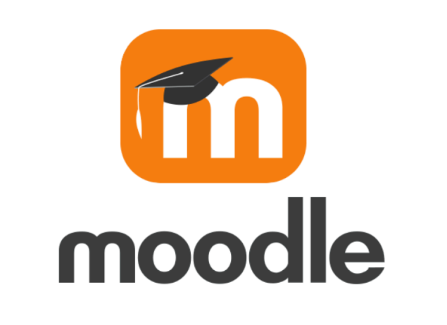

# **Moodle: Plataforma Educativa** 🎓📚  
Sistema de Gestión de Aprendizaje (LMS)

---

**Moodle** es una plataforma educativa de código abierto que permite la creación, gestión y distribución de contenidos educativos. Su diseño permite tanto a instituciones como a individuos ofrecer una experiencia de aprendizaje digital interactiva y flexible.

---

## 🎯 **¿Por qué Moodle?**

En un entorno educativo cada vez más digital, Moodle ofrece una solución robusta para la enseñanza en línea, ayudando a instituciones, empresas y profesores a crear cursos efectivos y accesibles.

---

## 📱 **¿Qué hace?**

- Creación de cursos interactivos.
- Herramientas para evaluar el desempeño de los estudiantes.
- Facilita actividades colaborativas como foros y chats.
- Acceso desde dispositivos móviles, tablets y PCs.
- Control de progreso y gestión de usuarios.

---

## ⚙️ **Tecnologías utilizadas**

- **Frontend**: HTML, CSS, JavaScript
- **Backend**: PHP
- **Base de datos**: PostgreSQL
- **Servidor**: Apache
- **Otros**: Plugins para funcionalidad extendida

---

## 🚀 **¿Cómo funciona?**

1. El administrador instala y configura Moodle en un servidor.
2. Los instructores crean cursos, actividades y recursos didácticos.
3. Los estudiantes se registran y acceden a los cursos.
4. El sistema evalúa el progreso de los estudiantes y proporciona retroalimentación.

---

## 🎯 **Público objetivo**

- Instituciones educativas.
- Empresas que buscan formación interna.
- Estudiantes y profesores interesados en educación en línea.

---

## 🔐 **Seguridad**

Moodle ofrece medidas de seguridad avanzadas para proteger los datos de los usuarios, incluyendo encriptación de contraseñas y control de acceso detallado.

---

## 🧠 **Autores y colaboradores**

Este proyecto es desarrollado por una comunidad activa de expertos en tecnología educativa con el fin de mejorar la calidad del aprendizaje a través de soluciones digitales.

---

## 🚧 **Estado del proyecto**  
Este proyecto aún está en proceso de desarrollo. Actualmente, se están configurando los módulos de evaluación, integración con otros sistemas y la mejora de la interfaz de usuario. Aún falta completar varias características, y se trabajará en la optimización de la seguridad y la escalabilidad en las próximas fases.

---

📌 **Este repositorio contiene el código fuente, la documentación técnica y guías de uso para la implementación de Moodle.**
